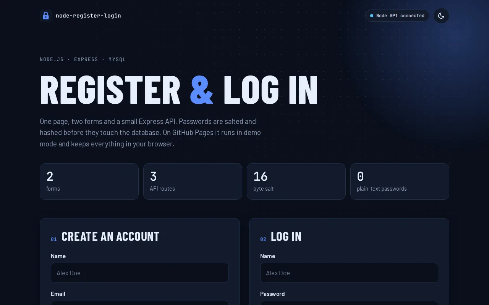

# Node Register & Login

A register and login page with a Node.js + Express + MySQL backend that stores only salted password hashes.

**[Live demo](https://brutall100.github.io/node-register-login/)** · **[Source code](https://github.com/brutall100/node-register-login)**



## About

This is one of my first back-end projects. The page has two forms, one to create an account and one to log in. The forms send JSON to a small Express API, and the API saves users in a MySQL database.

GitHub Pages can only host static files, so there is no Node server there. The live demo notices this and switches to **demo mode**: accounts are saved only in your own browser (`localStorage`), and the passwords are still hashed. When you run the project locally with MySQL, the badge in the top bar changes to **Node API connected**.

## Features

- Register and log in on one page, with clear success and error messages
- Passwords hashed with a random 16-byte salt and `crypto.scrypt`, and checked with `timingSafeEqual`
- SQL queries use placeholders (`?`), which protects against SQL injection
- Checks the input in the browser and again on the server
- Password strength meter and a show/hide password button
- Demo mode that works without a server (used on GitHub Pages)
- Light and dark theme: follows your system, and the toggle remembers your choice
- Initials avatar (SVG) after login, so no photo is needed
- Animated dot-grid background, button ripples, count-up numbers and scroll reveals
- Works on phones (390px) with no sideways scrolling
- Accessible: skip link, visible focus ring, labelled fields, and `prefers-reduced-motion` support

## Built with

- HTML, CSS and vanilla JavaScript
- [Node.js](https://nodejs.org/) 18+ and [Express](https://expressjs.com/)
- [MySQL](https://www.mysql.com/) (or MariaDB) through [mysql2](https://github.com/sidorares/node-mysql2)
- Fonts: Barlow Condensed, Barlow and JetBrains Mono (Google Fonts)
- Colors: a calm sage & beige palette: `#8FA28A` sage, `#C7D3C0` light sage, `#F7F4ED` cream, `#C8A96B` beige

## What I learned

- How a form sends data to a server, and how the server answers with status codes (201, 400, 401, 409, 500)
- Why a password must never be saved as plain text, and how a salt + hash works
- How placeholders in SQL queries stop SQL injection
- How to keep secrets like the database password in environment variables instead of the code
- How to build a page that still works when the back end is missing

## Run it locally

You need [Node.js](https://nodejs.org/) 18 or newer and a MySQL or MariaDB server.

```bash
git clone https://github.com/brutall100/node-register-login.git
cd node-register-login
npm install

# create the database and the users table
mysql -u root -p < server/schema.sql

# start the server
npm start
```

Open <http://localhost:9999>. The database settings have defaults (`root`, no password, database `reg_and_log`). To change them, set the environment variables listed in [`.env.example`](.env.example), for example:

```bash
DB_USER=app DB_PASSWORD=secret npm start
```

Only want to see the page? Open `index.html` through any static server and it runs in demo mode.

## Project structure

```
node-register-login/
├── index.html          # the page
├── css/style.css       # all styles, light and dark theme
├── js/app.js           # forms, theme toggle, animations, demo mode
├── images/favicon.svg  # icon
├── docs/screenshot.webp
├── server/
│   ├── server.js       # Express API: /api/health, /api/register, /api/login
│   └── schema.sql      # database and users table
├── .env.example        # settings you can change
└── package.json
```

## Credits

- Fonts by [Google Fonts](https://fonts.google.com/): Barlow and Barlow Condensed by Jeremy Tribby, JetBrains Mono by JetBrains
- "Alex Doe" is a made-up example name
- License: [CC0 1.0](LICENSE), free to use for anything
